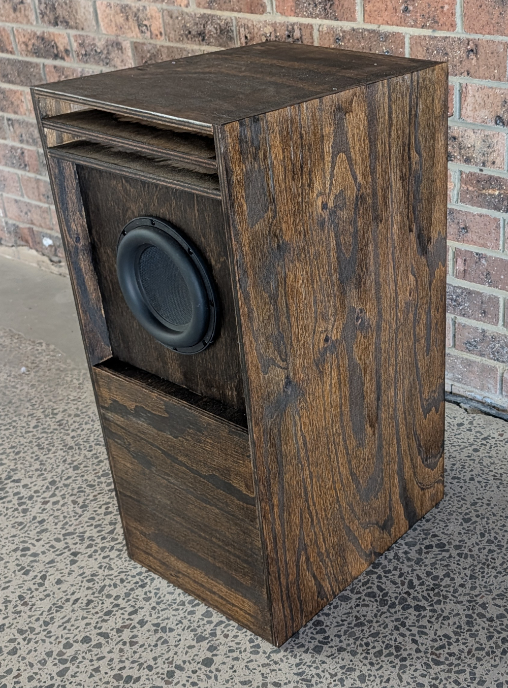
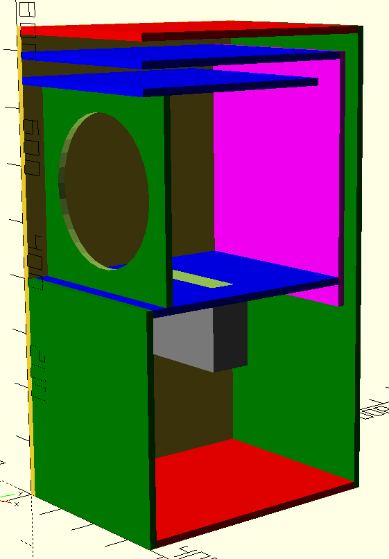
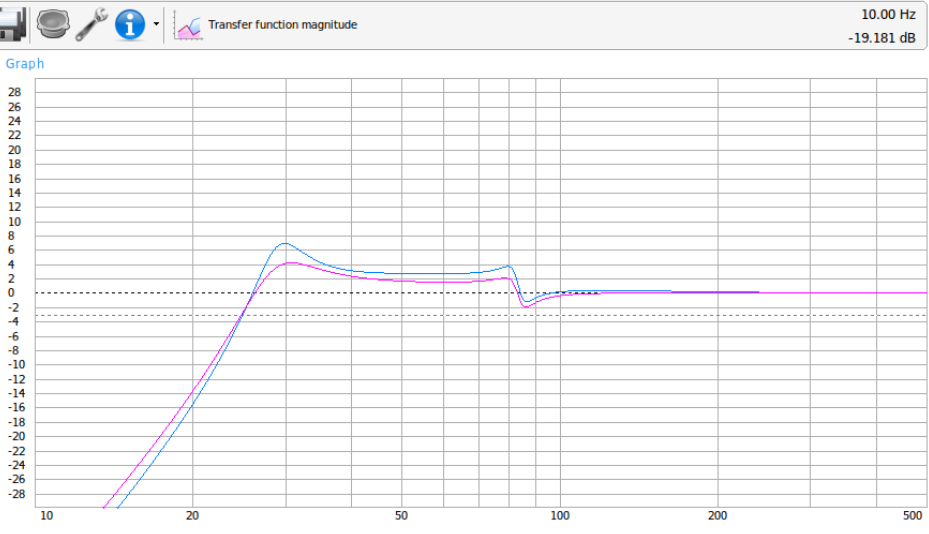
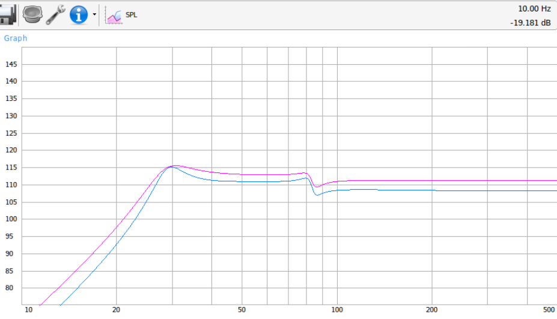
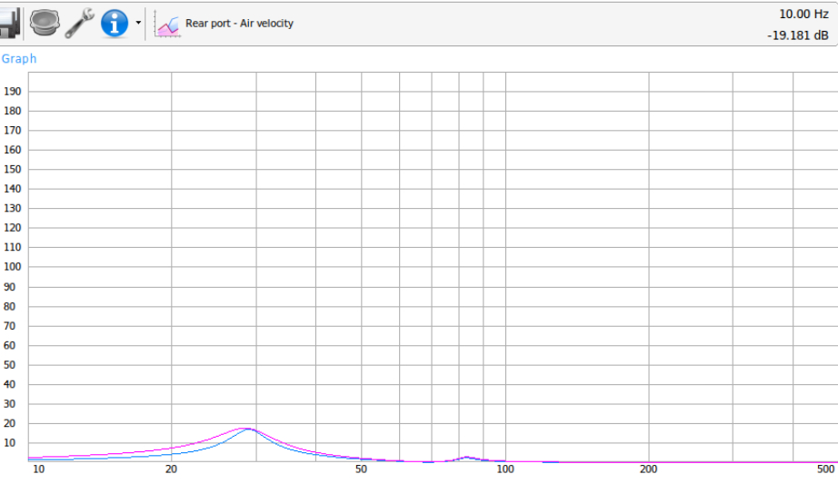
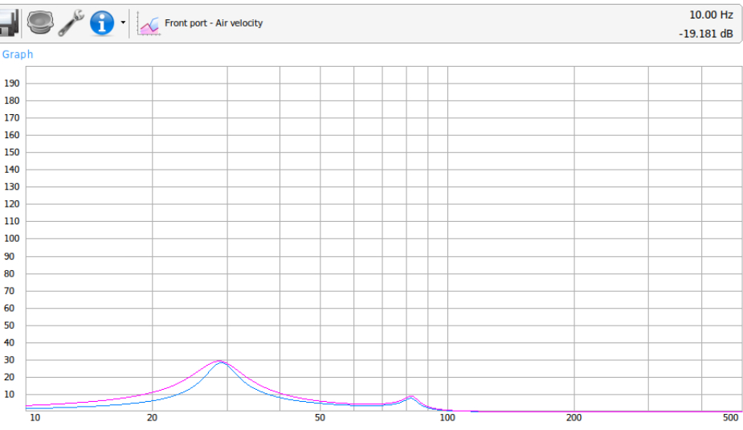
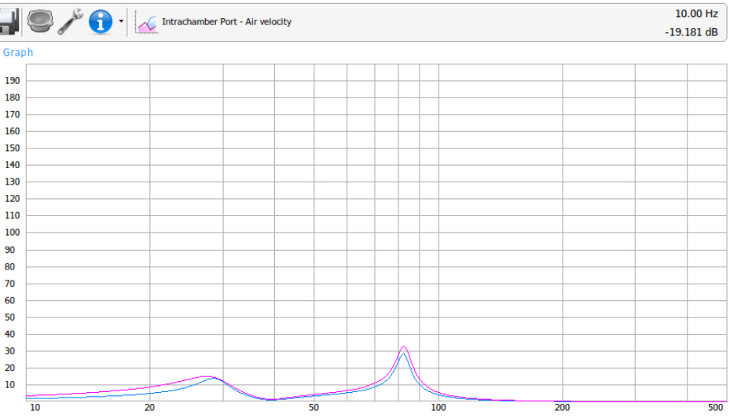
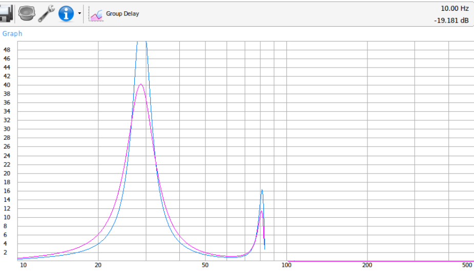
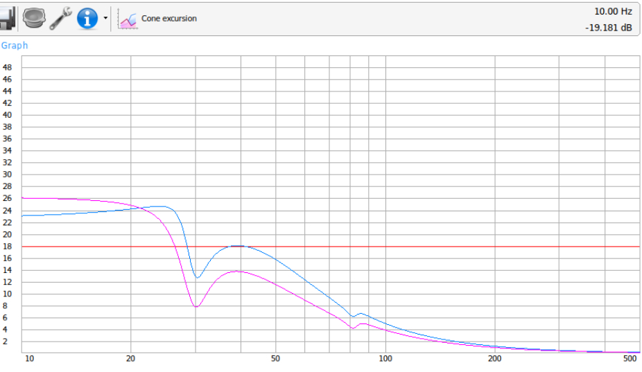

## Dayton Ultimax 8"/10" subwoofer enclosure

Enclosure design for Dayton UMII8-22 Ultimax II 10" or UNII10-22 8" subwoofers.

It's better with the 10" driver but works well for both.

General info for drivers:
[Ultimax 10"](https://www.daytonaudio.com/product/2063/umii10-22-ultimax-ii-10-dvc-subwoofer-2-ohms-per-coil)
[Ultimax 8"](https://www.daytonaudio.com/product/2062/umii8-22-ultimax-ii-8-dvc-subwoofer-2-ohms-per-coil)

Spec sheet for drivers:
[Ultimax 10"](https://www.daytonaudio.com/images/resources/295-710--dayton-audio-UMII10-22-spec-sheet.pdf)
[Ultimax 8"](https://www.daytonaudio.com/images/resources/295-708--dayton-audio-UMII8-22-spec-sheet.pdf)

Enclosure design is based on modelling in WinISD.

Overall box dimensions using 13mm ply/mdf is:
* 376mm wide
* 476mm deep
* 841mm tall

3D model of the enclosure can be viewed at [ultimax_8_10_abc.stl](ultimax_8_10_abc.stl)

OpenSCAD code for generating the model of the enclosure is in [ultimax_8_10_abc.scad](ultimax_8_10_abc.scad)

This enclosure is designed for the frequency range of 27 Hz to 80 Hz

## Panel sizes

For 13mm plywood

* Sides: 841 x 476
* Top: 463 x 350
* Bottom: 450 x 350
* Rear: 841 x 350
* Front Bottom: 401 x 350
* Speaker Panel: 341 x 350
* Divider: 407 x 350
* Rear Port Horizontal: 420 x 350
* Rear Port Vertical: 450 x 350
* Front Port Horizontal: 370 x 350

Front and rear ports should have bracing, one against the rear panel and one
each on the horizontal parts of the ports, for a total of 3 braces.

Mid-port between front and rear chamber is inner dimensions of 200mm x 50mm
and is 130mm long.

Front panel is set back 40mm from the front to allow for a grill.

Approx volumes:
Front chamber: 43L
Rear chamber: 61L

## Modelling

Using [WinISD](https://www.linearteam.org/)

Setup:

* 1 Driver
* ABC

Parameters:

* Rear chamber 61 L tuned to 23 Hz
* Front chamber 43 L tuned to 39 Hz
* Rear chamber port square shape 3cm x 35cm
* Front chamber port square shape 3cm x 35cm
* Intrachamber 5cm x 20cm with 13cm vent length
* 500W input signal

Metrics:

8" driver

* Enclosure gain: 7.0 dB at 30.0 Hz
* -3db from peak of 4.0 dB at 27.5 Hz
* -3db at 24.9 Hz
* Peak SPL at 500W: 115 dB at 30.0 Hz
* Peak port air velocity: 28 m/s at 28.9 Hz
* Maximum cone excursion at 500W: 28.5 Hz and 39.1 Hz

10" driver

* Enclosure gain: 4.3 dB at 30.8 Hz
* -3db from peak of 1.3 dB at 27.0 Hz
* -3db at 24.8 Hz
* Peak SPL at 500W: 115 dB at 30.8 Hz
* Peak port air velocity: 29 m/s at 28.7 Hz
* Maximum cone excursion at 500W: 25.6 Hz

The 10" driver can be driven up to 1000W before cone excursion becomes an issue
but for direct comparison the above numbers are all for 500W signal.

Overall the enclosure has a flatter response with a 10" driver, but works well
for both.

## Charts

Results from modelling in WinISD

8" in blue

10" in purple

### Transfer magnitude function

### SPL

Using 500W signal for both

### Rear port air velocity

### Front port air velocity

### Intrachamber port air velocity

### Group delay

### Cone excursion

